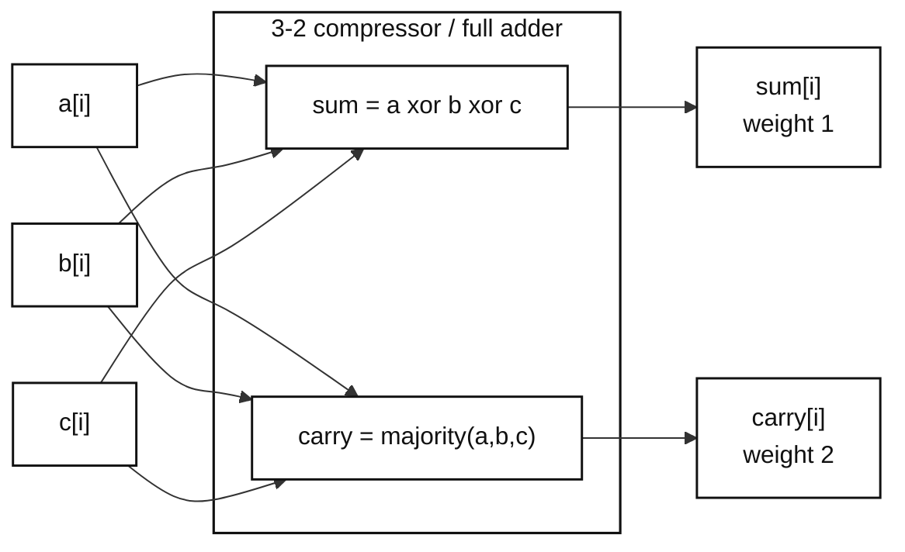
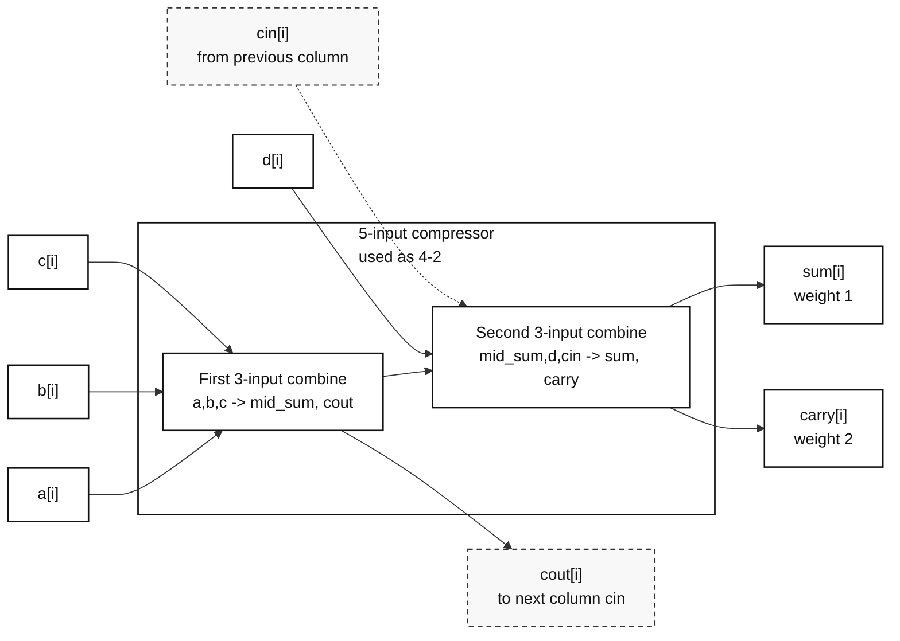
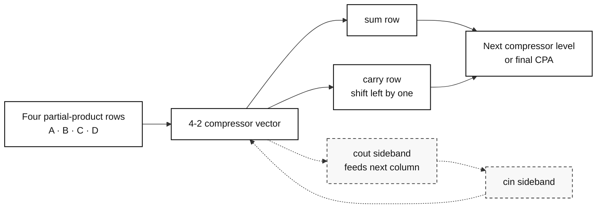
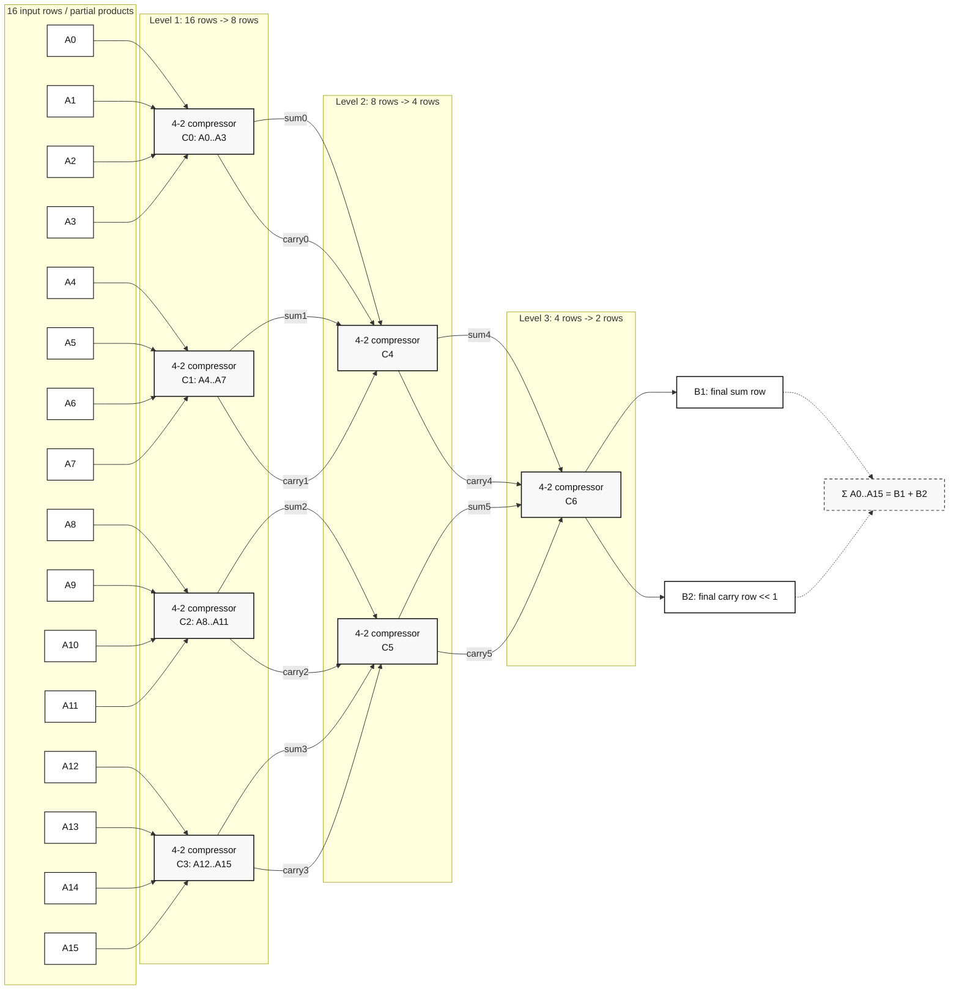

# FPU Compressor Notes

This note records the bit-compressor blocks used by multiplier reduction trees
and by small lookup-table interpolation datapaths. Booth recoding is deliberately
left out here; this page only describes the compression cells.

Current RTL:

- `rtl/common/fpu_compressors.sv`
- `fpu_compressor_3_2`
- `fpu_compressor_4_2`

## 3-2 Compressor

A 3-2 compressor is the one-column full-adder form used across a vector of bit
columns:

```text
a + b + c = sum + 2*carry
```

`sum` remains in the same bit column. `carry` has weight two and is therefore
shifted left by one when it is consumed by the next reduction level or by a
final carry-propagate adder.



Reduction-tree view:


## From 5-3 To 4-2

The implemented `fpu_compressor_4_2` is best understood as a five-input
compressor with two carry outputs:

```text
a + b + c + d + cin = sum + 2*carry + 2*cout
```

In an array, the `cout` produced by one column is naturally routed as the
neighbor column's `cin`. For that reason this five-input structure is commonly
called a 4-2 compressor: it reduces four local rows plus a carry-in sideband
into one local sum row, one local carry row, and one carry-out sideband.



Array-level view:



## 4-2 Compression Tree View

At the reduction-tree level, a 4-2 compressor is useful because every level
roughly halves the number of rows while preserving the weighted sum. For a
16-row example:

```text
A0 + A1 + ... + A15 = B1 + B2

16 rows -> 8 rows -> 4 rows -> 2 rows
          level 0    level 1    level 2
```

The final two rows `B1` and `B2` are then added by a normal carry-propagate
adder. This is the main picture to keep in mind for multiplier partial-product
reduction: compressors do not finish the addition; they reshape many aligned
rows into two aligned rows with the same numeric value.



Here `B1` is the final sum row and `B2` is the final carry row after its
one-bit weight shift. A final carry-propagate adder can later compute
`B1 + B2`, but the compressor tree itself is only responsible for preserving
`sum(A0..A15)` while reducing sixteen rows to two rows.

The code in `fpu_compressor_4_2` writes this directly as Boolean compressor
logic rather than instantiating two `fpu_compressor_3_2` submodules. The shape
is still the same conceptual evolution: 3-2 full-adder compression, then a
five-input form that becomes a practical 4-2 compressor when `cout` is chained
between columns.
