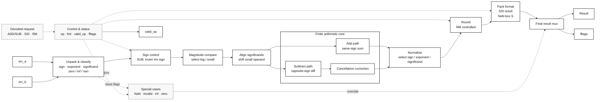
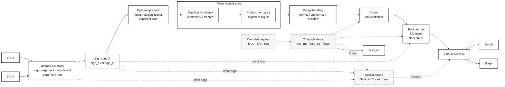
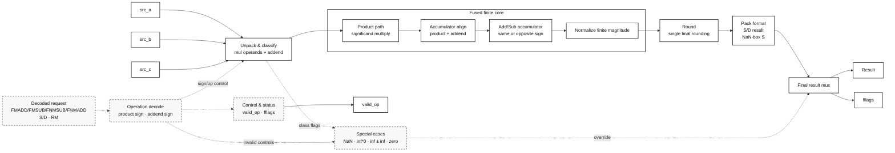
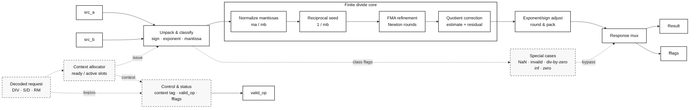
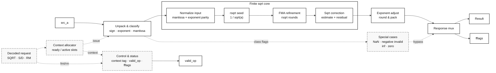
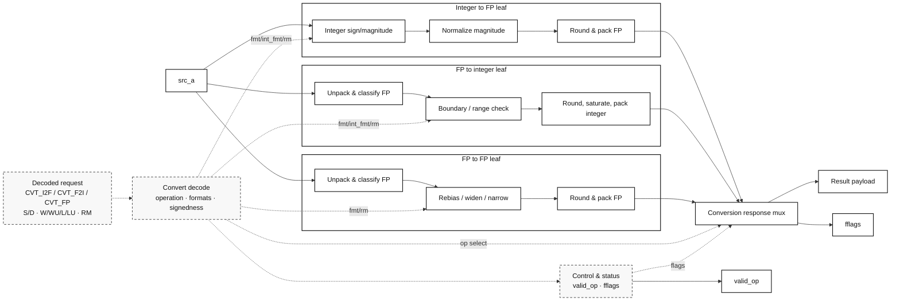
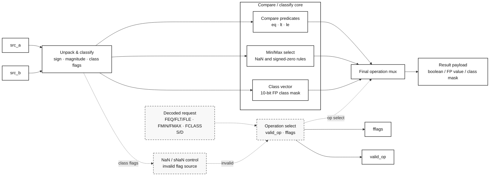

# FPU Unit Flow Notes

This note records the natural dataflow of each current FPU unit. It is meant
as a code-reading and future pipelining guide; it does not define new behavior.

Recommended source organization for later cleanup:

1. Module-level flow comment.
2. Global typedefs and packed structs.
3. Global datapath/control signals.
4. Shared helper functions.
5. Main datapath in input-to-output order.
6. Final special-case/result mux and response pack.

When a helper is used by only one small block, keep it near that block. When it
is shared by the whole module, keep it with the global helper functions.

## Add/Sub Unit

Current module: `rtl/units/fpu_add_unit.sv`

Natural flow:

```text
req_i
  |
  v
unpack lhs/rhs
  |
  v
apply SUB sign inversion to rhs
  |
  v
choose big/small by exponent and significand
  |
  v
compute exp_diff and same-sign control
  |
  +--> S path: 24-bit significand + GRS workspace
  |
  +--> D path: 53-bit significand + GRS workspace
          D path keeps only guard/round/sticky workspace.
          Bits shifted out by alignment are reduced into sticky.
  |
  v
align small significand, jam lost bits into sticky
  |
  v
same sign: add aligned significands
opposite sign: subtract aligned significands
  |
  v
subtract path leading-one detect
  |
  v
normalize add/sub result and update exponent
  |
  v
select GRS and retained LSB
  |
  v
round increment
  |
  v
pack finite result
  |
  v
special-case/result mux: invalid, NaN, infinities, zeros, finite
  |
  v
resp_o, valid_op_o
```

Diagram:



Suggested code sections:

```text
Types and global signals
Pack/NaN/rounding helper functions
Unpack and operand ordering
S-format align/add/sub/LOP datapath
D-format align/add/sub/LOP datapath
Normalize and finite significand assembly
GRS selection and round increment
Finite pack
Special-case output mux
```

Future pipeline anchors:

```text
S0 unpack/order
S1 align and sticky
S2 add/sub and LOP
S3 normalize, round, pack
```

## Multiply Unit

Current module: `rtl/units/fpu_mult_unit.sv`

Natural flow:

```text
req_i
  |
  v
unpack lhs/rhs and classify special cases
  |
  v
compute result sign
  |
  v
53 x 53 significand multiply
  |
  v
product leading-one detect
  |
  v
normalize product into 64-bit finite_sig workspace
  |
  v
compute raw exponent
  |
  v
normal/subnormal selection
  |
  v
subnormal right shift and jam, if needed
  |
  v
select GRS and retained LSB
  |
  v
round increment
  |
  v
pack finite result
  |
  v
special-case/result mux: NaN, inf*0 invalid, infinities, zeros, finite
  |
  v
resp_o, valid_op_o
```

Diagram:



Suggested code sections:

```text
Types and global signals
Pack/NaN/rounding helper functions
Unpack and product setup
Significand multiplier
Product LOP and normalization
Exponent/subnormal adjustment
GRS selection and round increment
Finite pack
Special-case output mux
```

Future pipeline anchors:

```text
S0 unpack/classify/sign
S1 significand multiply
S2 product normalize and exponent adjust
S3 round, pack, special-case mux
```

## FMA Unit

Current module: `rtl/units/fpu_fma_unit.sv`

Natural flow:

```text
req_i
  |
  v
decode FMA variant and signs
  |
  v
unpack lhs/rhs/addend and classify special cases
  |
  v
53 x 53 product
  |
  v
product leading-one detect and addend leading-one detect
  |
  v
compute product/addend bit-base exponents
  |
  v
choose common accumulator top exponent
  |
  v
align product and addend into 160-bit accumulator domain
  |
  v
same sign: accumulator add
opposite sign: magnitude compare and subtract
  |
  v
finite magnitude leading-one detect
  |
  v
normalize accumulator magnitude into 64-bit finite_sig workspace
  |
  v
compute raw exponent
  |
  v
normal/subnormal selection
  |
  v
subnormal right shift and jam, if needed
  |
  v
select GRS and retained LSB
  |
  v
round increment
  |
  v
pack finite result
  |
  v
special-case/result mux: NaN, inf*0 invalid, inf +/- inf invalid, infs, zero, finite
  |
  v
resp_o, valid_op_o
```

Diagram:



Suggested code sections:

```text
Types and global signals
Pack/NaN/rounding helper functions
Accumulator alignment helper functions
Unpack, operation decode, and sign control
Product multiply and leading-one detect
Accumulator exponent selection and alignment
Accumulator add/sub and sign selection
Finite LOP, normalization, exponent/subnormal adjustment
GRS selection and round increment
Finite pack
Special-case output mux
```

Future pipeline anchors:

```text
S0 unpack/classify/sign decode
S1 significand multiply and product/addend LOP
S2 accumulator alignment
S3 accumulator add/sub and normalize
S4 round, pack, special-case mux
```

## Divide Unit

Current module: `rtl/units_pipe/fpu_div_unit_pipe.sv`

The divide unit is a multi-cycle interleaved pipe. It keeps several active
contexts and uses a private FMA pipe for reciprocal refinement and final
quotient correction.

Coarse flow:

```text
req_i
  |
  v
unpack/classify lhs/rhs
  |
  +--> special-case response: NaN, invalid, divide-by-zero, inf, zero
  |
  v
finite path:
  normalize mantissas
  reciprocal seed lookup
  Newton refinement
  quotient estimate
  residual correction
  exponent/sign correction
  pack and flag result
  |
  v
resp_o, valid_op_o
```

Diagram:



## Square-Root Unit

Current module: `rtl/units_pipe/fpu_sqrt_unit_pipe.sv`

The square-root unit is also a multi-cycle interleaved pipe. It uses an rsqrt
seed, a private FMA pipe, and a final correction step before packing the true
sqrt result.

Coarse flow:

```text
req_i
  |
  v
unpack/classify source
  |
  +--> special-case response: NaN, invalid negative, inf, zero
  |
  v
finite path:
  normalize source mantissa and exponent parity
  rsqrt seed lookup
  reciprocal-sqrt refinement
  sqrt estimate
  residual correction
  exponent/sign correction
  pack and flag result
  |
  v
resp_o, valid_op_o
```

Diagram:



## Convert Unit

Current module: `rtl/units/fpu_convert_unit.sv`

The file contains three leaf datapaths and one selector wrapper:

```text
fpu_convert_i2f_unit
fpu_convert_f2f_unit
fpu_convert_f2i_unit
fpu_convert_unit
```

### I2F Flow

```text
req_i
  |
  v
decode integer format and sign
  |
  v
convert signed input to magnitude
  |
  v
leading-one detect
  |
  v
left normalize magnitude
  |
  v
form S/D exponent and significand candidates
  |
  v
extract S/D GRS
  |
  v
round increment
  |
  v
mantissa increment and exponent carry
  |
  v
pack S/D result and flags
  |
  v
resp_o, valid_op_o
```

### F2F Flow

```text
req_i
  |
  v
decode source/destination format
  |
  +--> S to S: NaN-box S input
  |
  +--> D to D: pass D input
  |
  +--> S to D:
  |      unpack S
  |      rebias exponent
  |      widen significand/NaN payload
  |      pack D
  |
  +--> D to S:
         unpack D
         classify normal/subnormal/overflow/NaN
         for subnormal S result, right shift and jam
         select GRS and retained LSB
         round increment
         mantissa increment and exponent carry
         pack NaN-boxed S result and flags
```

### F2I Flow

```text
req_i
  |
  v
unpack S/D floating-point input
  |
  v
decode integer destination signedness and width
  |
  v
compute exponent boundaries and shift amount
  |
  v
right shift significand into integer magnitude
  |
  v
extract/jam lost bits into GRS
  |
  v
round increment
  |
  v
increment magnitude
  |
  v
check rounded overflow/invalid cases
  |
  v
apply integer sign or saturation result
  |
  v
pack flags and response
```

### Convert Wrapper Flow

```text
req_i
  |
  +--> i2f leaf
  +--> f2f leaf
  +--> f2i leaf
  |
  v
select leaf response by req_i.op
  |
  v
resp_o, valid_op_o
```

Diagram:



Future pipeline anchors:

```text
S0 decode/unpack/classify
S1 shift/align and GRS generation
S2 round, pack, wrapper select
```

## Compare/Classify/Minmax Unit

Current module: `rtl/units/fpu_compare_unit.sv`

Natural flow:

```text
req_i
  |
  v
unpack lhs/rhs and classify
  |
  v
decode compare/minmax/class operation
  |
  v
compute NaN/sNaN flags
  |
  +--> compare: equal/less/less-or-equal
  |
  +--> minmax: NaN handling, signed-zero handling, magnitude compare
  |
  +--> class: class bit vector
  |
  v
pack integer result and flags
  |
  v
resp_o, valid_op_o
```

Diagram:



Future pipeline anchors:

```text
Usually keep combinational or one registered output stage.
If needed, split after unpack/classify.
```

## Sign-Injection Unit

Current module: `rtl/units/fpu_sgnj_unit.sv`

Natural flow:

```text
req_i
  |
  v
decode format and SGNJ/SGNJN/SGNJX operation
  |
  v
extract source signs
  |
  v
compute result sign
  |
  v
inject sign into src_a payload
  |
  v
resp_o, valid_op_o
```

Future pipeline anchors:

```text
Keep combinational or use one registered output stage for interface alignment.
```
